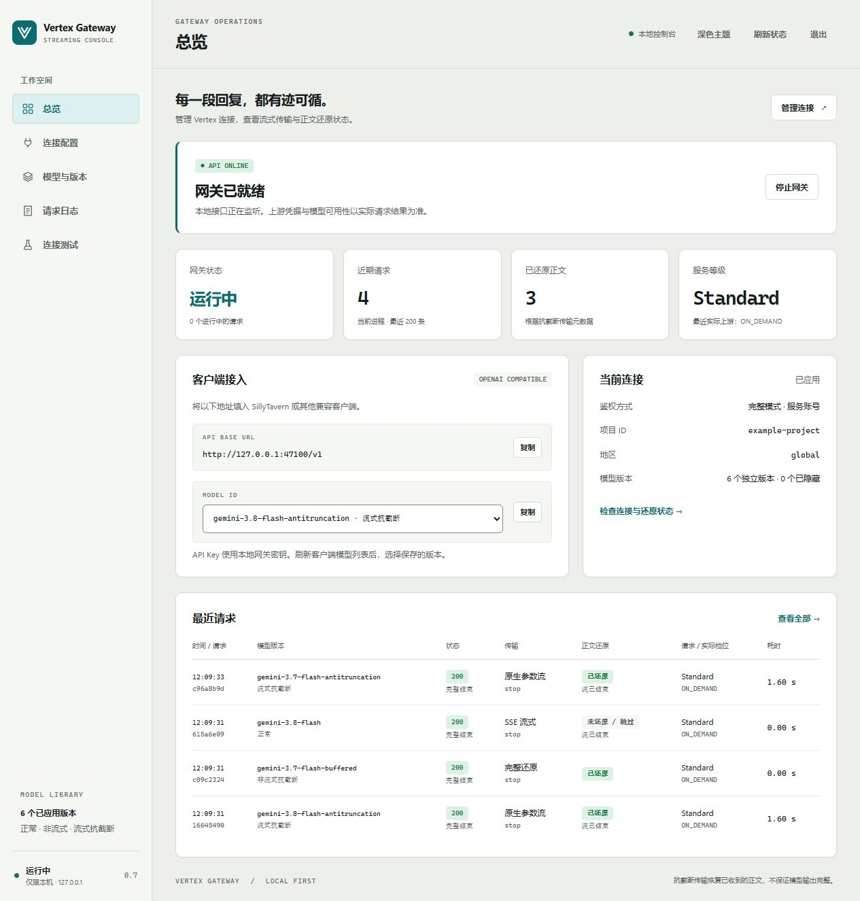
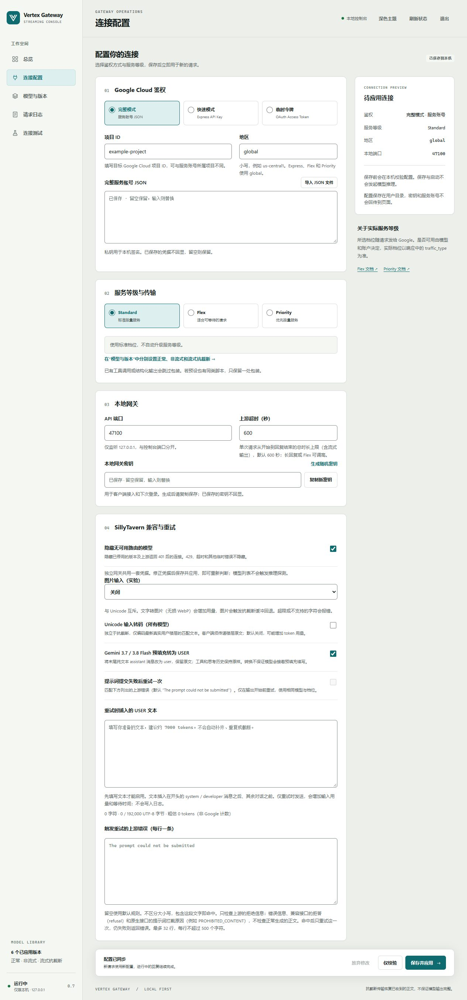
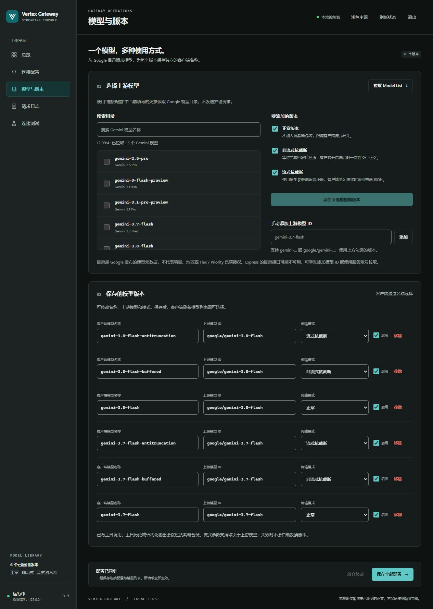
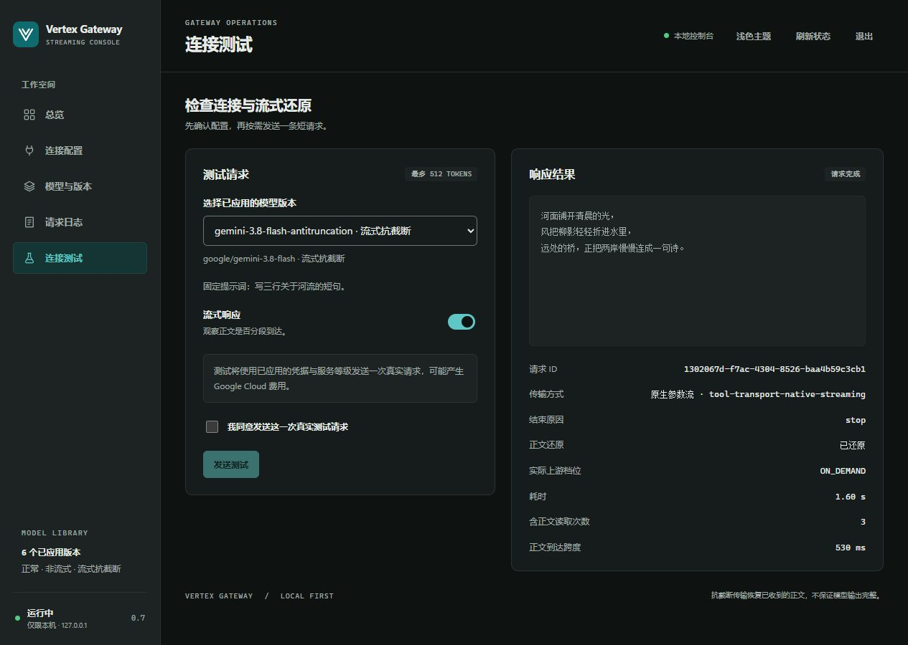

# Vertex Streaming Anti-Truncation

[中文](README.md) | English

A local gateway for Vertex AI / Gemini with a model library and optional text-tool transport. Save normal, buffered anti-truncation and streaming anti-truncation aliases for each upstream model, then select them from SillyTavern's custom OpenAI connection.

Experimental release with configurable Gemini models. The existing Gemini 3.7 Flash alias remains the default. Model and function-argument streaming availability depend on Google. Requires Node.js 22.9+ and uses @napi-rs/canvas plus the bundled OFL-licensed Noto CJK font for optional text-to-image input.

A paired SillyTavern UI extension and server plugin can also add the transport selector directly to the existing Google Vertex AI connection panel. It reuses Tavern credentials and runs inside the Tavern process. Disabled by default; see the [installation and validation guide (Chinese)](docs/SILLYTAVERN.md).

In Tavern's **Install extension** dialog, paste `https://github.com/ken050210/vertex-streaming-anti-truncation` and leave the branch blank. **The server companion is also required:** run `node plugins.js install https://github.com/ken050210/vertex-streaming-anti-truncation` from the SillyTavern root, then run `npm ci --ignore-scripts` in `plugins/vertex-streaming-anti-truncation` to install the renderer that image input needs, enable `enableServerPlugins`, then restart Tavern. Installing the UI alone is insufficient. Do not install a second copy over an existing manual installation; follow the migration notes in the guide. Alternatively, download the one-step package from [Release `sillytavern-v0.3.1`](https://github.com/ken050210/vertex-streaming-anti-truncation/releases/tag/sillytavern-v0.3.1), extract it and run its installer (`install-windows.cmd` on Windows, `sh install.sh <SillyTavern folder>` elsewhere) to place both halves and enable server plugins without Git.

## Credits

The synthetic text-tool transport design comes from [Antigravity-gateway](https://github.com/Xeltra233/Antigravity-gateway) by [Xeltra233](https://github.com/Xeltra233).

## Console preview

These screenshots use demo configuration and a simulated upstream, showing the Chinese-language console in light and dark themes. The ports shown are demo ports; the defaults are `4780` for the console and `4781` for the API. The screenshots show version 0.7.0.

**Overview**: gateway status, client connection details, saved model profiles and recent requests.



<details>
<summary>Connection settings: project ID, service account / Express API key, Standard / Flex / Priority</summary>



</details>

<details>
<summary>Model library: discover models and save normal, buffered and streaming anti-truncation profiles</summary>



</details>

<details>
<summary>Connection test: streaming output, restoration status and arrival statistics</summary>



</details>

## How streaming works

The original project already parses SSE incrementally. If Vertex's OpenAI-compatible endpoint waits for complete tool arguments before returning them, the client still receives the reply all at once. For supported text requests, this gateway uses Vertex's native function-argument stream and forwards each decoded fragment as it arrives.

| Project | Path and focus |
| --- | --- |
| Antigravity Gateway | A general OpenAI-compatible gateway with synthetic text-tool transport and incremental SSE parsing |
| This project | Calls native `streamGenerateContent`, enables `streamFunctionCallArguments`, and converts received `partialArgs` into ordinary `delta.content` |

The HTTP test holds the simulated upstream open until the client receives the first text fragment. This checks that delivery begins before completion. Actual delivery timing still depends on the model; [Google lists streaming function call arguments as Preview](https://docs.cloud.google.com/vertex-ai/generative-ai/docs/multimodal/function-calling#streaming_function_call_arguments).

```text
SillyTavern / OpenAI-compatible client
  → local gateway: synthetic text tool
  → Vertex native partialArgs stream
  → incremental JSON decoding
  → ordinary SSE delta.content
```

## Setup

Choose a full Vertex service-account JSON, an Express mode API key, or a short-lived OAuth access token. Full mode requires a Google Cloud project with the Vertex AI API enabled and permission to call the model. Inference is billed to your Google Cloud account.

```sh
git clone https://github.com/ken050210/vertex-streaming-anti-truncation.git
cd vertex-streaming-anti-truncation
npm ci --ignore-scripts
npm start
```

Open the console link printed in the terminal (default `http://127.0.0.1:4780/`). On first launch, use the setup link containing a local bootstrap key. On Windows you can also double-click `Start-GUI.cmd`. No `.env` is required for GUI setup.

The console includes light/dark themes, responsive layout, overview, connection settings, metadata-only request logs and a bounded test page:

- Enter the target project ID and paste/import the **complete service-account JSON**, or select **Express API Key** or **OAuth Token**. A service account's project can be filled automatically and overridden for cross-project access. Express uses a projectless global endpoint; its optional project field is only a note. Express API keys and access tokens must be visible ASCII: a pasted value with smart quotes or full-width characters is rejected when saved.
- Select **Standard, Flex or Priority**, an API port and timeout. Anti-truncation is chosen per model profile under **模型与版本**. Express and non-standard tiers require `global`.
- Generate and copy a local gateway key (at least 16 visible ASCII characters, no spaces) before saving. Saved credentials are write-only; blank fields retain previous values. Use that key for client access and subsequent console sign-in. After the first save, if another authentication mode still has a stored credential, the connection page offers "delete other modes' saved credentials on save" (保存时删除其他鉴权方式已保存的凭据). Saving with it checked removes them from settings.json; changing the authentication mode clears the checkbox. Changing the gateway key signs out other console sessions; other saves keep them.
- Save and apply without interrupting active replies. Port conflicts preserve the old listener and configuration. After an API port change, connections a client still holds on the old port receive `503 gateway_port_changed`; point the client at the new port. Starting, saving and validating do not call Google. The test page requires an explicit click and consent for each request, capped at 512 output tokens, with cancellation and streaming arrival statistics.

Settings are stored as plaintext in `~/.vertex-streaming-anti-truncation/settings.json`, outside the repository. Keep this directory private. Override it with `GATEWAY_STATE_DIR`; change the console port with `GUI_PORT` (default `4780`). The API port defaults to `4781`. Saves use revision checks and atomic replacement. Restarting the console loads saved settings and starts the gateway. Saved GUI settings take precedence over `.env` and the environment. Secrets are never stored in browser storage or returned by configuration APIs.

Before the first save, the console reads its initial values from `.env` and from system and user environment variables. A variable already set in the system or shell wins over `.env`, and an empty line in `.env` does not clear it (Node's `--env-file` rule, confirmed on Node.js 24.16). For example, if `GOOGLE_APPLICATION_CREDENTIALS`, which Google tooling often sets machine-wide, is present, the connection page preloads that service account and its field shows 已从环境变量导入 (imported from the environment). If you do not want that account, choose another authentication mode before saving (the first save stores only the selected mode's credential), or remove the system variable and restart the console. If an environment value is invalid, for example an unreadable file or more than one authentication method, the console ignores all environment settings, shows the reason and still opens.

If the process exits while recovering an expired configuration lock, a `settings.lock.recovery` marker may remain in the state directory and keep saves reporting another editor. Stop all console and configuration-writing processes, back up `settings.json`, then verify the filename and remove only `settings.lock.recovery` before restarting. Preserve the configuration file and the rest of the state directory.

Upgrading: if a saved gateway key, Express API key or access token (from settings.json, `.env` or the environment) contains non-ASCII characters, including Latin letters such as `é`, the gateway will not start, either at console autostart or with `npm run gateway`. The console still opens: sign in with the old key and save a visible-ASCII replacement. For CLI-only use, edit `.env` directly.

### Model library and variants

Enter credentials under **连接配置**, then open **模型与版本** and click **拉取 Model List**. Discovery uses the current connection form plus saved credentials, without starting inference or saving the draft. Search and select multiple models, check the variants to add, then click **保存全部配置** to save both connection and model drafts. Refresh the model list in your client afterwards.

| Variant | Behavior | Generated alias |
| --- | --- | --- |
| Normal | No wrapper; follows the client's `stream` setting | `<model>` |
| Buffered anti-truncation | Restores a complete upstream response; delivers it at once as SSE if requested | `<model>-antitruncation-nonstream` |
| Streaming anti-truncation | Native argument streaming for SSE; ordinary restored JSON otherwise | `<model>-antitruncation-stream` |

Save up to 100 profiles with unique public names, including Chinese aliases. Each row can change its upstream ID and mode. `/v1/models` exposes saved profiles. The add action skips existing upstream/mode pairs; manual edits may retain multiple aliases for the same pair. Saving an empty list exposes no models. Existing `gemini-3.7-flash-antitruncation` settings retain their name and previous enabled/disabled behavior on upgrade; explicit profiles replace the legacy global switch.

Discovery uses Google's paginated [publisher model catalog](https://docs.cloud.google.com/gemini-enterprise-agent-platform/reference/rest/v1beta1/publishers.models/list) and filters Gemini IDs. Catalog presence does not establish project access, region, modality or tier support. The [Express API reference](https://docs.cloud.google.com/gemini-enterprise-agent-platform/reference/express-mode/api-reference) does not guarantee listing support: if an API key cannot list models, use a service account for discovery or manually enter `gemini-…`, `google/gemini-…` or `publishers/google/models/gemini-…`. Errors preserve existing profiles and do not return a fabricated fallback catalog.

### CLI-only setup

Copy `.env.example` to `.env`: use `Copy-Item .env.example .env` in Windows PowerShell or `cp .env.example .env` on Linux/macOS. Set:

- `GATEWAY_API_KEY`: a random local access key you generate, at least 16 visible ASCII characters with no spaces.
- `VERTEX_PROJECT_ID`: your Google Cloud project ID. `VERTEX_LOCATION` defaults to `global`.
- `GOOGLE_APPLICATION_CREDENTIALS`: this line is commented out in `.env.example`. For a service account, remove the leading `#` and set the path to a service-account JSON file outside the repository. On Windows, `C:/keys/service-account.json` works.
- Alternatively keep that line commented and set `VERTEX_ACCESS_TOKEN`, or use `VERTEX_API_KEY` for Express mode (no project required). Choose exactly one authentication method; with none set, `npm run gateway` prints `Configure one Google authentication method: …` and exits.
- `VERTEX_SERVICE_TIER`: `standard` (default), `flex` or `priority`. Set `ANTI_TRUNCATION=false` to disable wrapping.
- `PORT`: defaults to `4781`.

Variables already set in the system or shell take precedence over `.env`. Generate a gateway key with this command, save it in `.env`, then start the service:

```sh
node -e "console.log(require('node:crypto').randomBytes(32).toString('hex'))"
npm run gateway
```

The service binds only to `127.0.0.1`. `GET /healthz` checks the process; every other endpoint requires `Authorization: Bearer <GATEWAY_API_KEY>`. The service-account private key signs a JWT locally. That JWT is sent to Google OAuth to obtain the short-lived access token used for model requests.

### Using a proxy for Google

The gateway reaches Google through Node's built-in fetch, which ignores proxy variables by default. To use a proxy:

- Set `NODE_USE_ENV_PROXY=1` in the system, user or shell environment **before Node starts**. Putting it in `.env` has no effect (tested on Node.js 24.16). If you start by double-clicking `Start-GUI.cmd`, set it as a Windows user environment variable.
- Set `HTTPS_PROXY` to your proxy, and preferably `NO_PROXY=127.0.0.1,localhost` so local connections, such as the console's connection test to the local gateway, bypass it. These two can be in the environment or in `.env`.
- This needs Node.js 22.21.0+ on the 22.x line, or 24.0.0+. Earlier 22.x releases ignore `NODE_USE_ENV_PROXY` and connect to Google directly.

```powershell
$env:NODE_USE_ENV_PROXY = "1"; $env:HTTPS_PROXY = "http://127.0.0.1:7890"; $env:NO_PROXY = "127.0.0.1,localhost"; npm start
```

```sh
NODE_USE_ENV_PROXY=1 HTTPS_PROXY=http://127.0.0.1:7890 NO_PROXY=127.0.0.1,localhost npm start
```

Replace `http://127.0.0.1:7890` with your proxy. `UPSTREAM_TIMEOUT_MS` also applies through the proxy; when Google cannot be reached, the log records `502 upstream_unreachable`. The proxy path has local tests only and no live verification yet.

## SillyTavern

Under Chat Completion, select the custom OpenAI-compatible connection:

| Setting | Value |
| --- | --- |
| API URL | `http://127.0.0.1:4781/v1` |
| API Key | The local gateway key from GUI setup or `GATEWAY_API_KEY` from `.env` |
| Model | A saved alias from the refreshed list; default `gemini-3.7-flash-antitruncation` |
| Streaming | Optional; buffered anti-truncation waits for the complete response |

If your preset already uses a similar text-tool transport script, keep only one wrapper enabled.

The gateway accepts the Anthropic-style field `thinking: {type: "disabled"}` as a no-op, matching Vertex's compatible endpoint. It does not disable Gemini thinking. Use `extra_body.google.thinking_config` for Gemini thinking settings.

### Roleplay compatibility settings

Use **Connection → SillyTavern compatibility and retry** to control each feature. Existing settings receive the same defaults on upgrade.

| Feature | Default | Behavior |
| --- | --- | --- |
| Hide models without an available route | On | Filter disabled profiles and known authentication failures from `/v1/models`; temporary errors remain visible |
| Gemini 3.7 / 3.8 Flash prefill to USER | On | Change the last plain-text `assistant` message to `user` before wrapping, preserving its text |
| Prompt submission retry | Off | Enter your own text first; errors matching a rule (one by default) can add one submission |

The standalone gateway shares one upstream connection. Disable a saved profile with its Enable checkbox without deleting it. Disabled profiles cannot be called, even when the visibility filter is off. An upstream HTTP 401 hides profiles on the rejected connection until settings are reapplied, the gateway restarts, or a direct request succeeds. HTTP 403/404/429, timeouts and 5xx do not hide profiles. Listing models never probes inference and does not establish Google project access.

Google's [3.7 Flash](https://docs.cloud.google.com/gemini-enterprise-agent-platform/models/guides/gemini-3-7-flash#mandatory-api-rules-and-behavioral-conventions) and [3.8 Flash](https://docs.cloud.google.com/gemini-enterprise-agent-platform/models/guides/gemini-3-8-flash#mandatory-api-rules-and-behavioral-conventions) guides disallow histories ending in a `model` turn and require removing prefills. Converting the role to USER is this project's workaround to retain the text; it changes the message semantics and does not guarantee prefix continuation. Only nonempty plain text or text-only arrays are converted. Tool, reasoning and other extra message metadata remain untouched.

Retry rules are editable in the console under "upstream errors that trigger the retry" (one per line). When empty, the only rule is `The prompt could not be submitted`. Each rule is plain text matched case-insensitively as a substring; up to 32 rules of at most 500 characters. Only provider rejection fields are checked: `error.message` or string `error` (failed HTTP responses and SSE `event: error` also accept a top-level `message` or plain text), OpenAI-compatible `refusal` (Vertex's compatible stream places "The prompt could not be submitted. The prompt contains sensitive words…" in `delta.refusal`), and native prompt blocks from `promptFeedback.blockReason` / `blockReasonMessage` (Express, Flex and native streaming use the native API; add a reason code such as `PROHIBITED_CONTENT` if needed). HTTP errors, HTTP-200 error envelopes, refusals and initial SSE errors are inspected with a 64 KiB prefix limit. Quoted normal output does not match, and inspection stops on the first substantive text, reasoning, tool or other event. A provider error body that stalls is given up after about 5 seconds: the bytes received so far are checked against the rules, and the provider status is returned.

Supply around 7000 tokens of your own text. The GUI estimate is approximate, not Google's token count. Text is limited to 192000 UTF-8 bytes and inserted unchanged after leading `system` / `developer` messages, before the remaining conversation. It is not padded, repeated or truncated. Each client request can add at most one submission using the same model, credentials and tier. Cancellation, oversized requests and output already in progress prevent replay. A second failure ends the request. Added input can increase cost, context use and latency; successful submission is not guaranteed.

Logs add only `geminiCompatibility.prefillConverted` / `promptRetried` booleans and the console displays these outcomes; custom text is never logged. Response headers are `x-gemini-prefill-converted` / `x-gemini-prompt-retried`. CLI settings use `HIDE_UNAVAILABLE_MODELS`, `GEMINI_PREFILL_TO_USER`, `GEMINI_PROMPT_RETRY_ENABLED`, `GEMINI_PROMPT_RETRY_TEXT_FILE` pointing to an external UTF-8 file, and `GEMINI_PROMPT_RETRY_MATCHES` with rules separated by `|`.

### Unsupported parameters and upstream timeout

Requests to the following upstream models drop fields that Google documents as unsupported before the first submission, so they never fail first. The `x-gemini-dropped-params` header and the `droppedParams` log field list the removed field names, never their values.

| Upstream model | Dropped fields | Google source |
| --- | --- | --- |
| gemini-3.8-flash, gemini-3.7-flash | frequency_penalty, presence_penalty, n (candidate_count), temperature, top_p, top_k | [3.7](https://docs.cloud.google.com/gemini-enterprise-agent-platform/models/guides/gemini-3-7-flash) / [3.8](https://docs.cloud.google.com/gemini-enterprise-agent-platform/models/guides/gemini-3-8-flash) guides: "Remove the following unsupported parameters: frequency_penalty, presence_penalty, candidate_count, temperature, top_p, and top_k." |
| gemini-3.6-flash, gemini-3.5-flash-lite | frequency_penalty, presence_penalty, temperature, top_p, top_k | Model pages: "Custom values for parameters like temperature, top-K, and top-P aren't supported." and penalty values "aren't supported" |
| gemini-3.5-flash | frequency_penalty, presence_penalty, top_k | Guide: penalties cause "runtime errors"; model page: topK "64 (fixed)" |
| gemini-3-flash-preview, gemini-3.1-pro-preview, gemini-3.1-flash-lite, gemini-2.5-pro | top_k | Model pages: topK "64 (fixed)" |
| Any model | `reasoning_effort` when `extra_body.google.thinking_config` is also present | [OpenAI compatibility overview](https://docs.cloud.google.com/gemini-enterprise-agent-platform/models/migrate/openai/overview): "only one of reasoning_effort or extra_body.google.thinking_config may be specified" |

Sources are the official pages updated 2026-09-24 and checked 2026-09-25. Model IDs with an `@version` suffix use their base model; unlisted models are unchanged. Temperature/top_p stay where a model page still lists ranges, for example 3.5 Flash.

`UPSTREAM_TIMEOUT_MS` (default 600000) now also bounds waiting for response headers and between body chunks. Node's built-in fetch previously stopped after 300 s with `Headers Timeout Error` regardless of this setting. It is also the total limit for one request, counted from when the gateway receives it: generation still in progress is stopped, a stream that has already started is cut off, and the log records `504 upstream_timeout`. For very long replies or Flex, raise the upstream timeout in the console (up to 1800 s).

## Scope and limits

Streaming text requests use native function-argument streaming when their fields can be translated. In Standard service-account/OAuth mode, non-streaming requests use Vertex's OpenAI-compatible endpoint. Unsupported extension fields, media or extra message metadata retain their original values and fall back to that compatible endpoint, which may wait for the full reply. The response header `x-anti-truncation-transport` then reads `tool-transport-buffered-fields`.

Express and Flex use native endpoints for both regular and streaming requests. Priority with a service account or access token uses the OpenAI-compatible endpoint like Standard; only progressive output in "streaming" mode stays on native streaming, and Express Priority stays native. The native limits below apply only to requests on the native API. Supported inputs include text, inline base64 images, function tools and history, JSON/Schema output, candidate counts, and common sampling/thinking settings. Remote image URLs, legacy `functions`, `parallel_tool_calls`, logprobs and unknown extensions return `400 unsupported_native_fields` when they cannot be preserved. The gateway does not silently discard those fields or switch tiers. Real tools and structured output bypass wrapping but still use native translation.

An image's OpenAI `detail` becomes Gemini's request-wide media resolution only when every image in the request asks for the same level: `low`/`high` map to `MEDIA_RESOLUTION_LOW`/`MEDIA_RESOLUTION_HIGH`. Any image with `auto` or no detail (including rendered image-input pages), or a mix of levels, keeps the default. `extra_body.google.media_resolution` takes precedence; it returns 400 only if every image asks for a different single level. Images in system/developer messages return 400 (systemInstruction is text-only). Only leading system/developer messages become systemInstruction; later ones (post-history instructions, depth prompts) are sent in place as user text, like SillyTavern's own Google connection.

Requests with existing tools/functions, explicit tool selection, tool history, JSON/Schema output or multiple candidates skip the wrapper. Genuine tools, usage, thinking metadata and finish reasons such as `length` or `content_filter` are preserved. Interrupted streams fail; the gateway does not continue or retry them automatically.

On native routes (the streaming mode's native transport and every Express or Flex request) and on buffered-mode SSE replies, the gateway sends the empty-choices usage chunk only when the request sets `stream_options.include_usage: true`. Streams from Vertex's OpenAI-compatible endpoint (normal mode, and streaming-mode requests that fall back to it with Standard or full-mode Priority) pass the client's `stream_options` to Vertex and carry whatever usage chunks Vertex sends. `router_anti_truncation` arrives on the finish chunk.

“Anti-truncation” describes transporting and restoring text that has been received. It cannot recover text the model never generated or the network never delivered, guarantee complete replies, or bypass model limits.

Tiers are selected explicitly and never automatically upgraded, downgraded or switched. Flex/Priority send Google's tier headers. The requested tier and the actual tier (`usage.traffic_type` on native responses, `usage.extra_properties.google.traffic_type` on compatible ones) are logged separately; missing upstream tier metadata remains unknown. Model/account availability, including Express tier support, requires real upstream verification. See the official [Express endpoint](https://docs.cloud.google.com/gemini-enterprise-agent-platform/models/start/express-mode/overview), [Flex](https://docs.cloud.google.com/gemini-enterprise-agent-platform/models/flex-paygo) and [Priority](https://docs.cloud.google.com/gemini-enterprise-agent-platform/models/priority-paygo) documentation. This package has no multi-account scheduler or quota manager.

## Response and Schema validation

Every profile checks completion output and finish reasons. Streams also require a terminal reason for every candidate and `[DONE]`. Empty or reasoning-only successful replies, broken tool arguments, error events and premature EOF fail validation. Length limits and refusals remain explicit; the gateway does not invent a successful stop. After content reaches the client, an error closes the stream without replaying the request.

Native routes use `responseJsonSchema` and `parametersJsonSchema`. They preserve `additionalProperties: false`, nullable types, local `$defs`/`$ref`, and arrays without `items`. Property names such as `$schema` remain intact; only dialect metadata at schema nodes is removed. Unsupported constraints, including `oneOf` and `pattern`, return `400 unsupported_native_schema` with a parameter path before authentication or inference. The path names the tool's index (for example `/tools/1/function/parameters/...`), and an unresolved `$ref` points at the node that holds it. Response-schema paths start with `/response_format/json_schema/schema`, or with `/response_format/json_schema` when the schema is sent without the `{name, schema}` wrapper. Standard compatible requests continue forwarding the original schema to Vertex.

Completed native JSON/Schema responses are parsed and checked against the supported constraints, including closed objects, required fields and array contents. `strict: true` is accepted for response schemas within that subset. Invalid output fails without automatic repair. Ordinary story text is not accumulated for logging; explicit structured output and tool arguments use bounded temporary validation buffers. Formats remain annotations, and length/filter endings are reported without requiring a finished JSON value.

Logs and the console add `responseIntegrity` metadata for complete, length-limited, filtered/refused, tool, empty, interrupted, failed and cancelled results. It contains only fixed enums and booleans. On native routes, `nativeFinishReason` also records Google's original finish code (for example `STOP` or `MALFORMED_FUNCTION_CALL`), accepted only as an uppercase enum; it is `null` on the compatible endpoint. Match errors to events using the response request ID.

Non-streaming failures distinguish `invalid_choice` (a non-object candidate), `missing_message` (absent or null message), `invalid_message` (wrong message type) and `unexpected_stream_chunk` (a delta-only chunk). Failed validation preserves known finish reasons and empty-response metadata in client errors, logs and the console. Missing messages remain failures: the gateway does not invent output or trigger custom-text recovery for these errors. Missing historical diagnostics cannot be reconstructed.

## Checking a request

JSON logs contain request IDs, status, duration and `antiTruncation` metadata. They exclude prompts, reply text, tool arguments and credentials. `GET /admin/events` returns the most recent 200 records held in memory; restarting clears them. Redirect standard output to a file outside the repository if you need persistent logs.

A failed `/v1/chat/completions` request returns `{"error": {"code", "message", "type", "requestId", …}}`. Common codes: `credential_error` (502: the token exchange failed, or the key or token contains characters, such as smart quotes, that cannot go in a request header), `upstream_unreachable` (502: Google could not be reached because of a network, DNS, TLS or proxy problem), `upstream_http_error` (keeps Google's HTTP status and `Retry-After`), `upstream_timeout` (504), `request_too_large` (413: the body exceeds 8 MiB; an upload that never finishes ends with 504 at the deadline), `image_render_failed` (503: local image rendering failed) and `upstream_protocol_error` (502: a malformed or interrupted upstream reply). Provider HTTP errors and provider error events before any output (`upstream_stream_error`, `native_stream_error`) also carry `upstreamError`: Google's `status`, its ErrorInfo `reason`, and a `message` with markup, email addresses, key-like strings, long tokens and the request's credential removed, capped at 240 characters. Logs record only `status` and `reason`.

A wrapped stream that finishes normally should have a successful request status and all of these values:

```json
{
  "antiTruncation": {
    "transport": "tool-transport-native-streaming",
    "restored": true,
    "finishReason": "stop",
    "streamDone": true
  }
}
```

`restored: false` means restoration did not occur or the wrapper was skipped. `null` means it has not been confirmed. A reply with `restored: true` and `length` still reached an output limit. These fields confirm restoration and the finish state; they do not prove that the same reply would have been truncated without the gateway. The console's connection test shows the same value as `antiTruncation.transport` in its 传输方式 (transport) row, and the request log also shows Unicode and image-input results.

```sh
npm run verify
# Optional: two billable client requests, up to four submissions if recovery is on; 512 output tokens each.
npm run smoke -- --live
```

The smoke command uses saved GUI settings, falling back to environment variables when no file exists. Add `--env` to explicitly target a CLI-only service configured through `.env`. It selects the first streaming anti-truncation profile by default; use `--model your-alias` to select another. The GUI test page supports normal and buffered profiles too. With image input enabled, the smoke command stops before sending anything: image requests use the buffered fallback, so progressive streaming cannot be checked. Turn image input off first.

The default tests use local fixtures, require no real credentials and incur no inference charges. The live smoke test measures content-bearing reads and their time span, then matches response request IDs to the logs. See [docs/VALIDATION.en.md](docs/VALIDATION.en.md) for the validation scope.

## Unicode input

The gateway's **Unicode input (all models)** setting is a separate, default-off global toggle (`UNICODE_INPUT=true|false`). Save/apply affects subsequent requests across normal, buffered and streaming modes. Enabled clients must supply `router_unicode_input: {user_floor: "latest actual user chat floor"}`. Missing source fails locally with 400; an expanded body exceeding the size limit fails with 413. The local field is stripped even when disabled. The encoding rules and current-floor matching follow an encoder by 灰鸠「GoldRush」 (the author's online name) and are included with the author's permission; see [NOTICE](NOTICE.md).

Only matching message text is encoded; unmatched input remains unchanged. Han characters and ASCII letters become `⟦U:…⟧`; tags, existing encoded blocks, digits, punctuation and emoji are kept, but letters inside `{{user}}` are not protected. Matches inside tags or existing `⟦U:…⟧` blocks elsewhere in a message are left unchanged (a deliberate difference from the reference); for this check, only a complete one-line tag such as `<剧情>` counts, so a stray `<` elsewhere in the message (for example `<3`) does not protect anything. Encoding of the floor itself keeps every `<…>` span, as the reference does. The three forms of the floor (original, trimmed and newline-normalized) are matched in one pass, longest first, and inserted blocks are never matched again. There is no serialized-JSON fallback: model IDs, tool names, schemas and media URLs remain intact. Tools/schema bypass does not disable input encoding. Response header `x-unicode-input` and fixed metadata/counts describe the result without logging prompt text.

For SillyTavern custom API connections, import and enable `integrations/sillytavern-unicode-floor.json` (default endpoint loopback port 4781; adjust `gatewayPort` in the script if needed). The script only supplies the floor text; the gateway switch decides whether to encode. It keeps the existing custom body configuration and needs Tavern's `/lib.js` YAML parser; disabling the script or reloading the page removes it. For native Vertex connections, choose Unicode in the paired extension's 输入转码 (input encoding) selector instead. Disable duplicate preset encoders. Encoding can increase tokens/latency and does not guarantee model comprehension. With extension UI v0.2.0 (then a separate checkbox), paired Tavern installation, toggle persistence and short live requests across all three transport modes passed; live import and persistence of the current UI 0.3.0 selector remain unverified. Long-context quality and truncation reduction remain untested. See the [acceptance record](docs/UNICODE-INPUT-AUDIT.md).

## Text-to-image input

Set IMAGE_INPUT to off (default), current-turn, or all, or use the console selector. Mutually exclusive with Unicode. Current-turn starts after the last assistant; all converts ordinary user/assistant text. System/developer instructions, tool contracts and original media remain unchanged. Pages are 1024px lossless WebP images (36 lines each). In all mode, with prefill-to-USER on, a trailing Gemini 3.7/3.8 Flash text prefill becomes a user turn before rendering. In current-turn mode, when nothing convertible follows the last assistant message (Continue, an assistant-role prefill), the turn is sent as text. Limits are 100 pages and 150000 UTF-16 units per request. Each user/assistant message (each text part) takes at least one page, so all mode fits about 100 messages with text; use current-turn for long chats. The base64 images must also fit the gateway's fixed 8 MiB request body, less whatever the rest of the request uses. Images total about 6 MiB: roughly 24k–45k Chinese characters (about 20–28 pages), about 80k characters of English with paragraph breaks (about 36 pages), and unbroken English prose up to the 150000-unit limit (about 41 pages), depending on content and line breaks. Overflow fails with `413 image_input_too_large`; unsupported emoji/control characters fail with 400 (text-style symbols such as ♥ © ™ render when the font covers them, and invisible format characters ZWSP, ZWNJ, WJ, BOM and VS15 are allowed); a missing renderer/font fails with `503 image_renderer_unavailable`, and a rendering or encoding failure with `503 image_render_failed`. Tabs become four spaces and line endings normalize. OCR is not lossless. Never silently falls back to plaintext. Image requests use buffered anti-truncation fallback; progressive delivery and reduced filtering are not promised. Logs contain only fixed metadata. Run npm ci --ignore-scripts after updates; include assets/fonts and the platform canvas binary in offline distributions. See the [image input validation record](docs/IMAGE-INPUT-VALIDATION.md).
